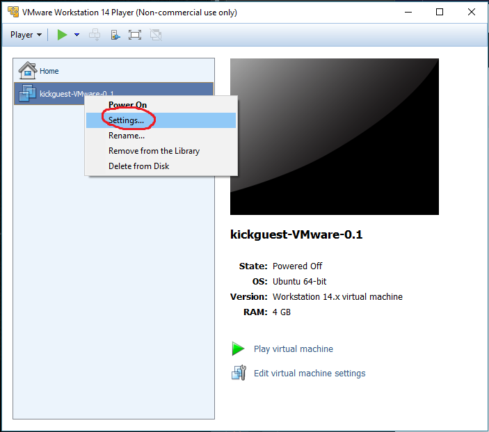

# Kickstart VMware Image

The simplest way to run docker and kickstart
on windows 8/10 and macOS.

- [Download latest release](https://github.com/infracamp/kickguest-win10-vmware/releases)

## Configuration

Map you *Projects* Path to a shared folder. (If unsure, map your home directory):

## Run the image

The image will start and:

- Create a ssh private/public key pair in `sharedFolder/.ssh/` (if not already existing)

